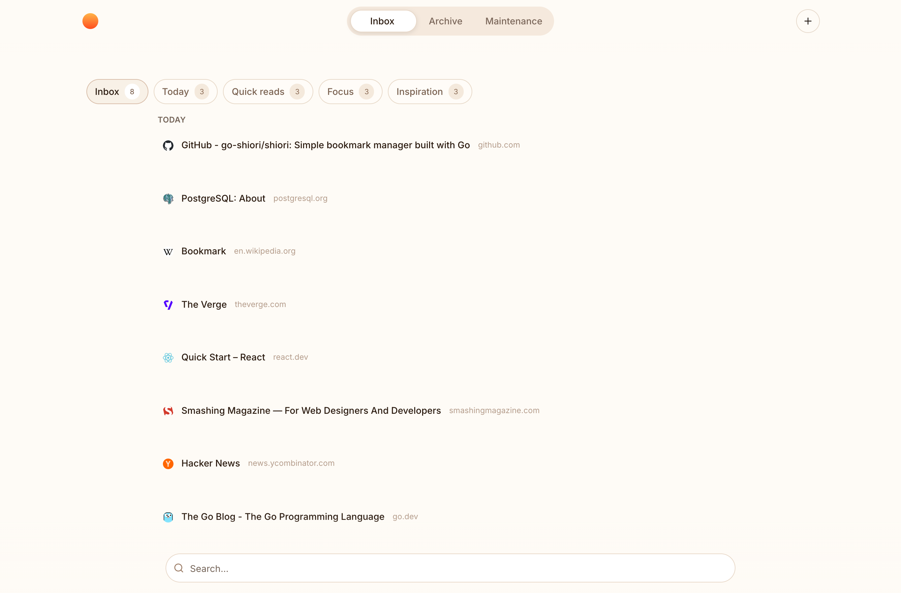
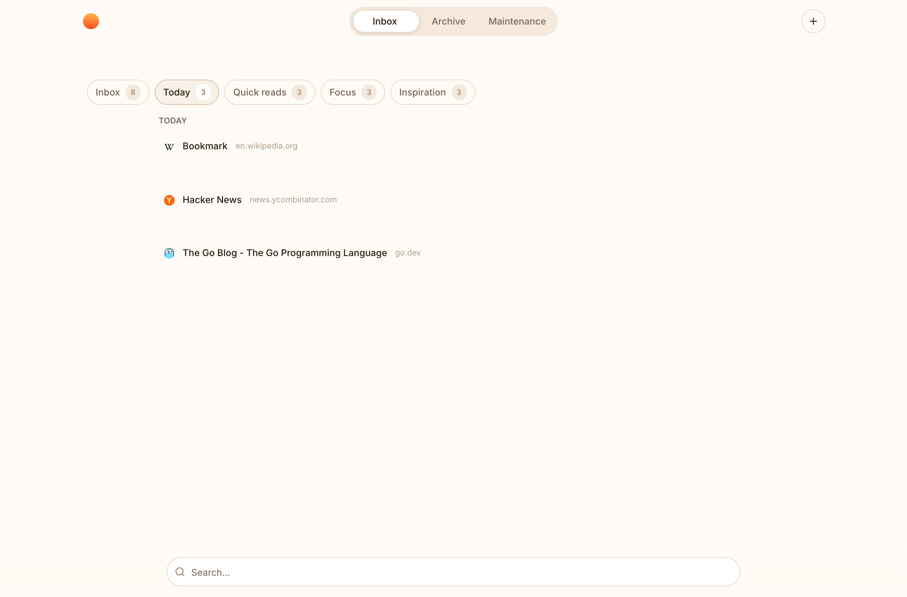
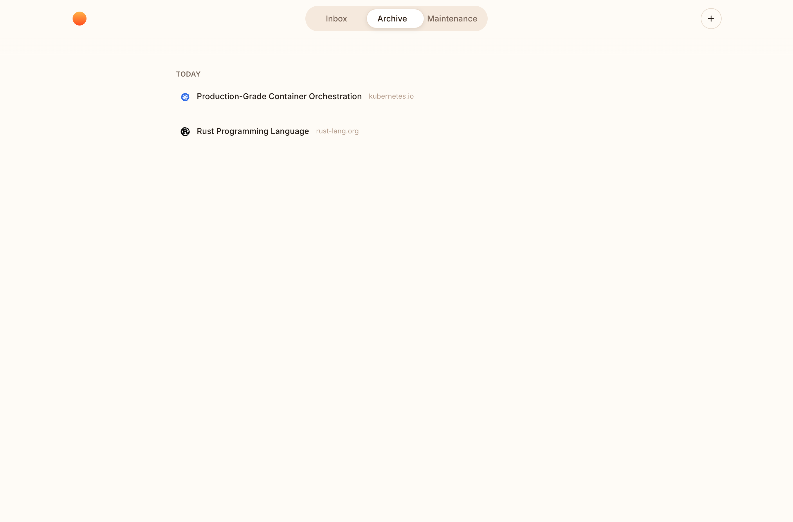
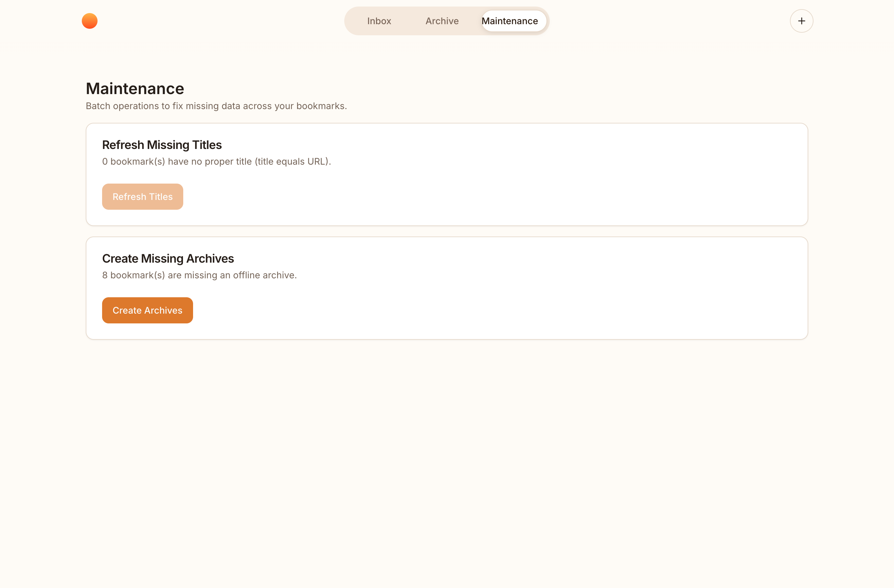
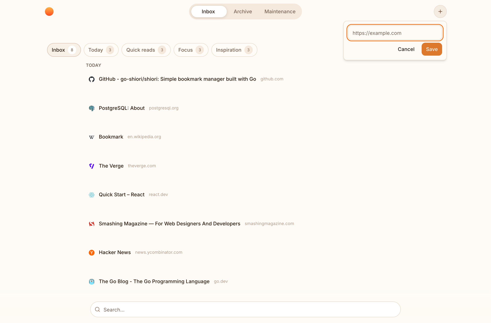
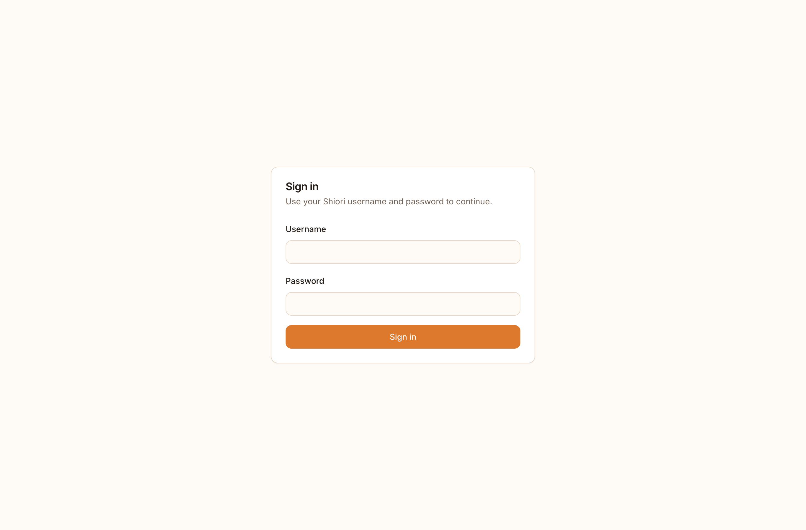
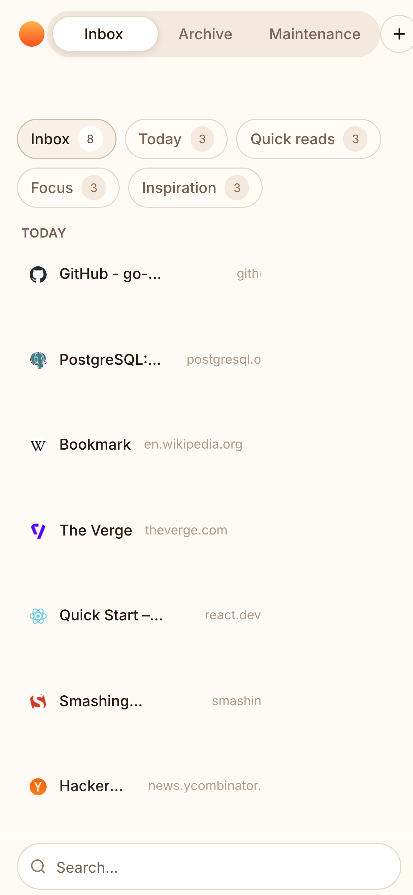

# Shiori — Operational Reading Fork

[](https://goreportcard.com/report/github.com/go-shiori/shiori)

A self-hosted bookmarks manager and read-later workflow, written in Go with a modern React web app. This is a customized fork of the original [go-shiori/shiori](https://github.com/go-shiori/shiori): the Go core (bookmark storage, archiving, multi-database support, single-binary distribution) is kept, while the web UI has been rebuilt around an **operational reading** workflow — answering *"what should I actually read today?"* on top of plain bookmark tags, with no extra database tables or parallel store.

Shiori still ships as a single binary with the web app embedded, and still runs on SQLite, PostgreSQL, MariaDB or MySQL.

## Screenshots

| Inbox | Today shortlist |
| --- | --- |
|  |  |

| Archive | Maintenance |
| --- | --- |
|  |  |

| Quick add (paste to save) | Sign in |
| --- | --- |
|  |  |

<p align="center">
  
  <br><em>Responsive mobile layout</em>
</p>

## How the app works

The web app is a single-page application with a small set of focused views, reached from the top pill navigation:

- **Inbox** — the operational reading surface. It lists every active (non-archived) bookmark and lets you slice it by workflow:
  - **Inbox** — everything active.
  - **Today** — the `read-today` shortlist (what you intend to read today).
  - **Quick reads** — `quickRead`, short/fast items.
  - **Focus** — `focus`, deep-work reading.
  - **Inspiration** — `inspiration`, idea fuel.

  Each chip shows a live count, the selected workflow is reflected in the URL, and a search box at the bottom narrows the visible set by URL, title or tag. A bookmark row opens the link directly.

- **Archive** — bookmarks tagged `archive`. They are excluded from the Inbox and can be restored or deleted from here.

- **Maintenance** — batch operations to fix incomplete data: **Refresh Missing Titles** (bookmarks whose title still equals the URL) and **Create Missing Archives** (bookmarks with no offline snapshot yet). Each card shows how many bookmarks are affected.

- **Quick add** — the `+` button opens an inline field; paste a URL and save it straight to the Inbox. PDFs can also be uploaded as bookmarks.

### Operational reading model

The workflow is built entirely on existing bookmark tags — **Shiori bookmarks remain the single source of truth**. There is no scheduling engine, no ranking model and no separate "reading queue" table. The operational intent lives in four tags:

| Tag | Meaning | Inbox chip |
| --- | --- | --- |
| `read-today` | Read today | Today |
| `quickRead` | Quick read | Quick reads |
| `focus` | Deep focus | Focus |
| `inspiration` | Inspiration | Inspiration |

Toggle these tags directly from the Inbox to move items in and out of each list. (`archive` is the only special tag outside this set, used by the Archive view.)

## Features

- Bookmark management: add, edit, delete, search, import/export (Netscape HTML, Pocket).
- Operational reading Inbox with workflow chips, live counts, URL-driven filters and instant search.
- Archive view with restore/delete and a dedicated Maintenance page for batch fixes.
- Quick-add / paste-to-save and **PDF upload** as a bookmark (served back inline at `/bookmark/{id}/pdf`).
- Offline archiving of readable page content where possible.
- JWT-based auth with an optional **control header** gate, and env-driven admin bootstrapping.
- A minimal **shortcut endpoint** (`POST /api/v1/shortcuts/bookmarks`) for automation clients (e.g. iPhone Shortcuts), with optional header-only auth.
- `refresh-inbox` CLI command + systemd timer to keep titles and workflow tags fresh.
- Single binary, web app embedded; SQLite / PostgreSQL / MariaDB / MySQL backends.

## Tech stack

- **Backend** — Go. Structured logging via the stdlib `log/slog`, errors via stdlib `errors`/`fmt.Errorf`, layered domains (auth, accounts, bookmarks, archiver, storage, tags). A versioned `/api/v1` HTTP API (Swagger/OpenAPI documented).
- **Frontend** — `webapp/`: React 18 + Vite + TypeScript, TanStack Query for data, React Router, Tailwind CSS with Radix/shadcn-style UI primitives and `lucide-react` icons. The API client under `src/client/` is generated from the OpenAPI spec.

## Running

### From source (single binary)

```sh
# Build the web app, then the binary (the binary embeds webapp/dist)
cd webapp && npm install && npm run build && cd ..
go build -o shiori .

# Serve (web app + API)
SHIORI_DIR=./data ./shiori server --port 8080
```

On first start, an owner account is created from `ADMIN_USER` / `ADMIN_PASS` (defaults `shiori` / `gopher`) if none exists. Open http://localhost:8080.

Add bookmarks from the CLI too:

```sh
./shiori add https://example.com -t read-today,focus
```

### Docker Compose (development)

```sh
docker compose up --build
```

`docker-compose.yaml` builds the app and provides PostgreSQL, MariaDB and MySQL services for testing different backends. Adjust the `environment` block (admin credentials, control header, `SHIORI_DATABASE_URL`) to taste.

### Frontend development

Run the Go server on `:8080`, then run Vite against it so `/api` calls are proxied:

```sh
cd webapp
VITE_API_BASE_URL=http://localhost:8080 \
VITE_API_CONTROL_HEADER_NAME=x-shiori-token \
VITE_API_CONTROL_HEADER_VALUE=<your-control-header-value> \
npm run dev
```

## Configuration

Key environment variables (see `internal/config/config.go` for the full list):

| Variable | Default | Purpose |
| --- | --- | --- |
| `SHIORI_DIR` | — | Data directory (SQLite DB, archives, thumbnails, PDFs) |
| `SHIORI_DATABASE_URL` | — | Use PostgreSQL / MySQL / MariaDB instead of SQLite |
| `SHIORI_HTTP_PORT` | `8080` | HTTP port |
| `ADMIN_USER` / `ADMIN_PASS` | `shiori` / `gopher` | Owner account created on first run |
| `CONTROL_HEADER_NAME` / `CONTROL_HEADER_VALUE` | empty | When set, the API requires this header (defense-in-depth gate) |
| `HTTP_ALLOW_HEADER_ONLY_SHORTCUT_AUTH` | `false` | Allow the shortcut endpoint to authenticate with the control header only |
| `SHIORI_HTTP_SECRET_KEY` | — | JWT signing secret |

The web app reads `VITE_API_BASE_URL` and `VITE_API_CONTROL_HEADER_NAME` / `VITE_API_CONTROL_HEADER_VALUE` at build time. When `VITE_API_BASE_URL` is empty the app is same-origin (the embedded build served by the Go binary).

## Inbox refresh automation

- `shiori refresh-inbox` refreshes bookmark title metadata and recalculates the workflow tags for non-archived bookmarks. Flags: `--skip-metadata`, `--with-archival`, `--limit N`.
- `scripts/refresh_inbox.sh` is a scheduler-friendly wrapper.
- `scripts/systemd/` provides a user-level service + timer that run the refresh every 2 hours.

Details: [docs/inbox-refresh-automation.md](docs/inbox-refresh-automation.md).

## Documentation

General Shiori documentation lives in the [docs folder](docs/index.md) — installation, configuration, storage, the CLI, and the v1 API (`docs/APIv1.md`, Swagger under `docs/swagger/`).

## License

Distributed under the [MIT license](https://choosealicense.com/licenses/mit/), inherited from upstream [go-shiori/shiori](https://github.com/go-shiori/shiori).
